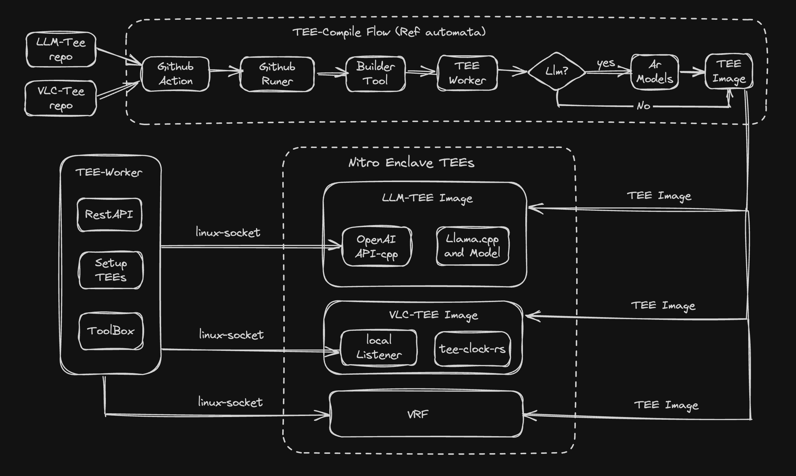

# Llm-In-TEE

## Overview

Run large AI models and verifiable logic clock in TEE environment.

Firstly, the semantic TEE of this repository is mainly refer to **aws nitro enclave** for now.  

Other TEE instances maybe support for later. For examples,
* Mircosoft Azure, 
* Intel SGX, 
* AMD SEV 
* or Nvidia Confidential Computing GPU

Second core module verifiable logic clock is an implementation of Chronos's TEE backend.   

The Chronos is a novel logical clock system designed for open networks with Byzantine participants, offering improved fault tolerance and performance. Please refer to [hetu chronos](https://github.com/hetu-project/chronos) repository for more details.

## Architecture



## Compile

### Build from source

```bash
git clone https://github.com/ai-chen2050/llm-in-tee.git

cd llm-in-tee

cargo build
```

## Run in TEE

Now, this repository use the aws nitro enclave as its trust execution environment.  

So, please create a cloud virtual instance and notice choose the `Amazon-2023 linux` as base image.  
Because this base operator system is more friendly for using of the aws nitro enclave.

### Prepare Env & Configuration

1. Prepare Env & install dependency tools
```sh
sudo sudo dnf upgrade 
sudo dnf install -y tmux htop openssl-devel perl docker-24.0.5-1.amzn2023.0.3 aws-nitro-enclaves-cli aws-nitro-enclaves-cli-devel
``` 

2. Configuration

Please `cat /etc/nitro_enclaves/allocator.yaml` and set cpu_count & memory_mib. For tee_vlc: just `2 core + 1024 M` is enough, for tee_llm: `4 core + 16384 M` at least. Update the file and save it.

3. run `init.sh`

```sh
cd scripts
sudo chmod +x init_env.sh
./init_env.sh
```  
Remember please re-run the script when you update the `/etc/nitro_enclaves/allocator.yaml`.